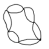
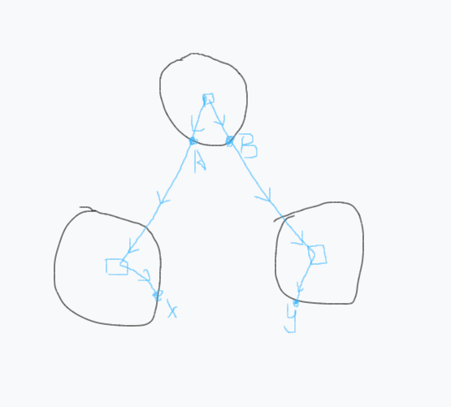

#### 仙人掌

仙人掌图即每条边最多只存在于一个简单环的无向图

形状和仙人掌（植物）很像

性质：

- 边数最多 $2n-2$ （大概这样）

##### 仙人掌判断


#### 圆方树

圆方树有狭义和广义之分，不搞清楚可能导致找资料时产生误解和歧义。

广义的圆方树可以处理一般图，对图上每一个点双连通分量（包括两点一线的子图）都建一个方点，故图中只有连接圆点和方点的边。

狭义的圆方树更常用，即对于仙人掌图，只对图上的环建方点，两点一线的子图不考虑。故图中会有两原点相连的边。

##### 狭义圆方树

构建：我们可以随便定一个节点作为转化后的根节点，从这个点开始跑tarjian。

Tarjian的过程中，遇到割边可以直接加入新图（对应两个圆点相连），然后对于每个环——

- 环有一个根节点（最早遍历到的点，同时在新图中作为这个环的根节点）
- 建一个方点，由根节点向方点连权值为0的边
- 由方点向其他每个点连权值 $w$ 的边，$w$ 为环上该点到根节点的最短距离

环上的最短距离无非两条，记录一下环上的前缀和可以轻松求出。

处理细节：Tarjian时，在环根节点处处理这个环，找到反向弧后，由最低点沿fa遍历整个环。

##### 应用

求仙人掌上两点最短路

若两点lca为圆点，则直接等于圆方树上距离。

否则它等于如图所示 $dis(x,A)+dis(y,B)+DIS(A.B)$：



即圆方树上到lca前一点的距离+AB两点的环上距离。


[洛谷模板题](https://www.luogu.com.cn/problem/P5236)

```c++
struct edge {
    int t, nt;
    ll w;
}e[maxn << 1];
int ecnt = 1;
int head[maxn], fa[maxn], faw[maxn];
int dfn[maxn], low[maxn], dfc = 0; //外部图

inline void addedge(int x, int y, ll w) {
    e[++ecnt] = {y, head[x], w};
    head[x] = ecnt;
}

namespace RStree {
    int n;
    vector<pair<int, ll>> vp[maxn << 1]; //圆方树的图
    ll sum[maxn << 1], sqrc = 0; //sum圆 = 环上前缀和（统一方向），sum方 = 环总和

    void init(int _n) {
        n = sqrc = _n;
        for(int i = 0;i <= 2 * n;i++) vp[i].clear();
    }
    void build(int p, int v, ll w) {
        //每个环buildtree一次，建方点，连边以及求出sum
        sum[v] = w;
        for(int i = v;i != p;i = fa[i]) {
            sum[fa[i]] = sum[i] + faw[i];
        }
        sum[++sqrc] = sum[p];
        vp[p].emplace_back(sqrc, 0);
        for(int i = v;i != p;i = fa[i]) {
            ll dis = min(sum[i], sum[sqrc] - sum[i]);
            vp[sqrc].emplace_back(i, dis);
        }
    }

    int ft[maxn << 1][22];
    ll dis[maxn << 1], dep[maxn << 1];
    void dfs(int p, int dp, ll ds) {
        dep[p] = dp, dis[p] = ds;
        for(auto [v, w]: vp[p]) {
            ft[v][0] = p;
            dfs(v, dp + 1, ds + w);
        }
    }
    
    void solve(int q) {	//处理询问
        dfs(1, 0, 0);
        for(int k = 1;k <= 20;k++) {
            for(int i = 1;i <= sqrc;i++) {
                ft[i][k] = ft[ft[i][k - 1]][k - 1];
            }
        }
        
        while(q-- > 0) {
            int x, y; cin >> x >> y;
            ll ans = 0;
            if(dep[x] < dep[y]) swap(x, y);
            for(int k = 20;k >= 0;k--) {
                if(dep[ft[x][k]] >= dep[y]) {
                    ans += dis[x] - dis[ft[x][k]];
                    x = ft[x][k];
                }
            }
            if(x == y) {
                cout << ans << '\n';
                continue;
            }
            for(int k = 20;k >= 0;k--) {
                if(ft[x][k] != ft[y][k]) {
                    ans += dis[x] - dis[ft[x][k]];
                    ans += dis[y] - dis[ft[y][k]];
                    x = ft[x][k];
                    y = ft[y][k];
                }
            }
            if(ft[x][0] <= n) ans += dis[x] + dis[y] - 2ll * dis[ft[x][0]];
            else {
                ll dxy = abs(sum[x] - sum[y]);
                ans += min(dxy, sum[ft[x][0]] - dxy);
            }
            cout << ans << '\n';
        }
    }
}

void tarjian(int p, int fid) {
    dfn[p] = low[p] = ++dfc;
    for(int i = head[p];i;i = e[i].nt) {
        if((i ^ 1) == fid) continue;
        int v = e[i].t;
        if(!dfn[v]) {
            fa[v] = p, faw[v] = e[i].w; //记录原图上的连父边
            tarjian(v, i);
            low[p] = min(low[p], low[v]);
            if(low[v] > dfn[p]) RStree::vp[p].emplace_back(v, e[i].w); //割边 直接加上
        } else low[p] = min(low[p], dfn[v]);
    }
    for(int i = head[p];i;i = e[i].nt) {
        int v = e[i].t;			//每个环都在根节点处处理
        if(dfn[v] > dfn[p] && fa[v] != p) RStree::build(p, v, e[i].w);
    }
}

void solve() {
    int n, m, q;
    cin >> n >> m >> q;
    RStree::init(n);
    for(int i = 1;i <= m;i++) {
        int x, y; ll w; cin >> x >> y >> w;
        addedge(x, y, w);
        addedge(y, x, w);
    }
    tarjian(1, 0);
    RStree::solve(q);
}
```

