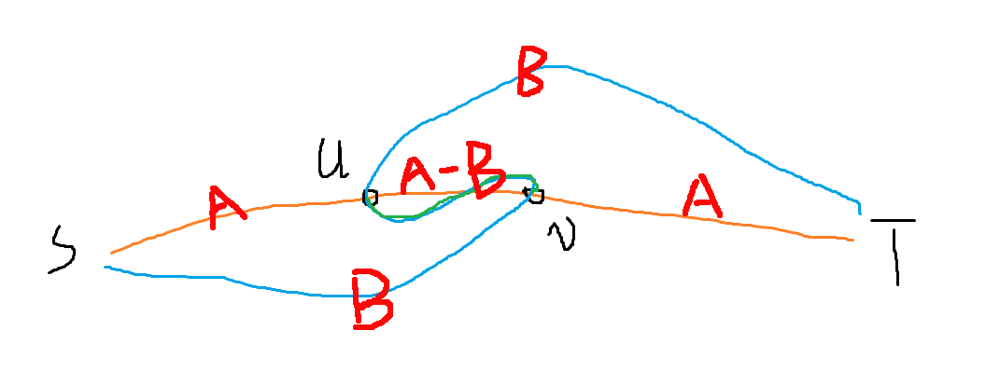

## 网络最大流

网络流有个最暴力的方式，称为EK算法，复杂度 $O(nm^2)$

其中比较难以理解的是反悔路径，我这么理解：

假如第一次找增广的时候找到了 $s...u-v...t$ 这样一条增广路，流量为 $A$

这时我们给增光路上所有边都建了一条反向的”反悔边“，包括 $v-u$，流量也为 $A$

然后第二次增广，我们找到了这样一条增广路：



其中橙色是第一次找到增广路，蓝色是第二次找的增广路，流量为 $B$，并且 $B\le A$，因为经过了第一条增广路的反悔边

这样搞完之后总流量为 $A+B$，可以理解为，实际上的流法是 $s$ 到 $u$ 流量为 $A$，随后分叉，$B$ 流量直接流向 $t$，$A-B$ 流量流向 $v$；

$s-v$ 的流量为 $B$，到 $v$ 点后与上述流量会和，$A$ 点流量从 $v$ 流向 $t$

这就是反悔边的工作原理了，可以看到这样做完之后，各个反悔边，残量网络等的情况全都符合实际。

走反悔边就相当于，不流那么多了，决定少流一些，更可以直接理解成回流一些流量。

颅内稍微拓展一下多个反悔边这样串起来的情况，容易理解这个东西的正确性

#### Dinic算法

暴力的EK算法仅助于理解反悔边的机制，实际肯定是不会用的

Dinic算法复杂度上界 $O(n^2m)$，基本都比FF快，稠密图中远快，在二分图匹配中为 $O(m\sqrt n)$

对其中不太理解的地方做个想法的记录：

- 为什么可以直接分层图来做？只走最短的能保证答案充分吗？
  - 其实答案的充分性不是因为走了分层图，而是因为不断地bfs直到bfs不到终点为止
  - 因为我们引入了返回流，所以其实不用担心某一步决策影响了答案的最优性，走最短仅仅因为这样效率最高，在bfs发现到不了终点时，答案一定已经是最优的了
- 关于 `if(tot == 0) dep[p] = 0;` 不是特别理解，dfs时随手会修改反向边等等，不会让这个点重新能连上终点吗？

```c++
namespace Flow{
    struct Edge{
        int t, nt;
        ll w;
    }e[maxn << 1];
    int n, st, ed, ecnt, head[maxn], dep[maxn];//n为节点数, 边号从2开始，^1即对偶边
    inline void init(int x, int y, int cnt){
        st = x, ed = y, n = cnt;
        ecnt = 1;
        for(int i=1;i<=n;i++) head[i] = 0;
    }
    inline void add(int x, int y, ll w){
        e[++ecnt] = {y, head[x], w};
        head[x] = ecnt;
        e[++ecnt] = {x, head[y], 0};
        head[y] = ecnt;
    }
    bool bfs(){
        for(int i=1;i<=n;i++) dep[i] = 0;
        queue<int> q; q.push(st);
        dep[st] = 1;
        while(!q.empty()){
            int u = q.front();
            q.pop();
            for(int i=head[u];i;i=e[i].nt){
                int v = e[i].t;
                if(!dep[v] && e[i].w){
                    dep[v] = dep[u] + 1;
                    q.push(v);
                }
            }
        }
        return dep[ed];
    }
    ll dfs(int p, ll flow){
        if(p == ed) return flow;
        ll tot = 0;
        for(int i=head[p];i && flow;i=e[i].nt){//注意&&flow不能省 很重要的剪枝
            int v = e[i].t;
            if(e[i].w && dep[v] == dep[p] + 1){
                ll d = dfs(v, min(flow, e[i].w));
                if(d > 0){
                    flow -= d;
                    tot += d;
                    e[i].w -= d;
                    e[i ^ 1].w += d;
                }
            }
        }
        if(tot == 0) dep[p] = 0;//意味着从这点开始一滴都没法流向终点了，直到重新分层前没必要再访问
        return tot;
    }
    ll getFlow(){
        ll maxFlow = 0;
        while(bfs()) maxFlow += dfs(st, INF);
        return maxFlow;
    }
}

void solve(){
    int n, m, s, t;
    cin >> n >> m >> s >> t;
    Flow::init(s, t, n);
    for(int i=1;i<=m;i++){
        int x, y;
        ll w;
        cin >> x >> y >> w;
        Flow::add(x, y, w);
    }
    cout << Flow::getFlow() << '\n';
}
```


割为一个边集，删去这些边之后源点和汇点无法联通

割的容量即为边容量之和，有：**最大流 = 最小割**

原因：既然一个流已经是最大流，那么残量网络中不含增广路，这个最大流流经的边里面，有若干满流的边，这些满流的边组成了割

求最小割：先跑一遍最大流，然后从源点dfs走残量网络，将能走到的点标记为s，不能走到的标记为t，从s到t的连边即为割。

求最小割对于有向图和无向图来说是一样的。


#### 上下界网络流

[感谢大佬](https://zhuanlan.zhihu.com/p/324507636)

[有源汇上下界最大流模板题](https://loj.ac/p/116)

```C++
//上下界可行最大流懒人拓展包
namespace Flow{
    ll dlt[maxn];
    int vst, ved, ets;//虚拟源点，汇点，t->s的附加边号
    inline void init(int s, int t, int vs, int vt, int cnt){
        init(vs, vt, cnt);//先由虚拟源汇点跑
        vst = vs, ved = vt;
        add(t, s, INF);//建立t->s的附加边
        ets = ecnt;
        fill(dlt, dlt+cnt+1, 0);
    }
    inline void add(int x, int y, ll wl, ll wr){
        add(x, y, wr - wl);
        dlt[x] -= wl;
        dlt[y] += wl;
    }
    bool fix(){ //在所有边插入完成后，调用此函数以补流
        ll req = 0;//计算虚拟源的的总流出量
        for(int i=1;i<=n;i++){
            if(dlt[i] > 0) add(vst, i, dlt[i]), req += dlt[i];
            if(dlt[i] < 0) add(i, ved, -dlt[i]);
        }
        return getFlow() == req;//返回是否存在可行流，
    }
    ll getFlow(int s, int t){//在fix成功之后，换源，计算最大流
        ll ans = e[ets].w;//得到的可行流流量即为t->s上的流量，接下来榨干网络
        st = s, ed = t;//切换源汇，删边
        e[ets].w = 0;
        e[ets ^ 1].w = 0;
        return ans + getFlow();
    }
}

void solve(){
    int n, m, s, t;
    cin >> n >> m >> s >> t;
    //s, t是源汇， n+1, n+2是差量网络上的虚拟源，汇

    Flow::init(s, t, n+1, n+2, n+2);
    for(int i=1;i<=m;i++){
        int x, y, wi, wx;
        cin >> x >> y >> wi >> wx;
        Flow::add(x, y, wi, wx);
    }
    if(!Flow::fix()){
        cout << "please go home to sleep\n";
        return;//无可行流
    }
    cout << Flow::getFlow(s, t) << '\n';
}
```

如果是无源汇判断可行流，就不需要添加 $t\rightarrow s$  的连边，跑到return处判完了即可

如果要求最小流，只需要把最后一部分改为从汇点到源点跑一遍最大流，由可行流减去最大流


#### 费用流

最小费用最大流就是给每条路径加了一个单位流量所需要的费用，然后问达到最大流量的最小费用（一般而言最大流的流法不止一种）

这个其实也和简单，将Dinic的bfs分层过程改成求单源最短路即可，dep（深度数组）改为dis（到源点距离数组）即可，dfs找流的时候仅走 $dis[v] = dis[u] + cost[i]$ 的边，相当于走最短路

求最短路的话，因为反向边的存在（反向边费用设为负的费用），不可以dijkstra，可以spfa（但是等价于 $O(nm)$ 的暴力最短路

也可以用Johnson最短路的思想：

开始先spfa（或ford）一遍，搞出初始的 $h$ 数组（**注意，网络流中永远是有容量的边才能走**）

之后将边权视为 $w+h_u-h_v$，Dij找最短路（直接记录路径），然后不用dfs增广了，直接对着最短路径流一遍

增广后图的形态会变，需要重新分配势能，将 $h_i+=dis_i$ 即可，原理见[OIWIKI](https://oi-wiki.org/graph/flow/min-cost/)，比较容易证明这样依然能保证所有边非负。

复杂度 $O(mlognf)$ 

```c++
namespace Flow{
    int n, st, ed;
    ll dis[maxn], h[maxn], pre[maxn];//记录最短路中连向它的边号
    struct Edge{
        int fr, to, nt;
        ll w, c;
        ll dis()const{//获取修正后的边权
            return c + h[fr] - h[to];
        }
    }e[maxn << 1];
    int head[maxn], ecnt;
    inline void init(int s, int t, int cnt){
        n = cnt, st = s, ed = t;
        ecnt = 1;
        for(int i=1;i<=n;i++) head[i] = 0;
    }
    inline void add(int x, int y, ll w, ll c){
        e[++ecnt] = {x, y, head[x], w, c};
        head[x] = ecnt;
        e[++ecnt] = {y, x, head[y], 0, -c};
        head[y] = ecnt;
    }
    void spfa(){
        vector<bool> vis(n+1, false);
        queue<int> q; q.push(st);
        h[st] = 0; vis[st] = true;
        while(!q.empty()){
            int u = q.front(); q.pop();
            vis[u] = false;
            for(int i=head[u];i;i=e[i].nt){
                int v = e[i].to;
                if(e[i].w > 0 && h[v] > h[u] + e[i].c){
                    h[v] = h[u] + e[i].c;
                    if(!vis[v]) vis[v] = true, q.push(v);
                }
            }
        }
    }
    bool dij(){
        struct node{
            ll t, dis;
            bool operator >(const node &x)const{
                return dis > x.dis;
            }
        };
        for(int i=1;i<=n;i++) dis[i] = INF;
        dis[st] = 0;
        priority_queue<node, vector<node>, greater<> > q;
        q.push({st, 0});
        while(!q.empty()){
            node u = q.top();
            q.pop();
            if(u.dis > dis[u.t]) continue;
            for(int i=head[u.t];i;i=e[i].nt){
                int v = e[i].to;
                if(e[i].w > 0 && dis[v] > dis[u.t] + e[i].dis()){
                    dis[v] = dis[u.t] + e[i].dis();
                    pre[v] = i;
                    q.push({v, dis[v]});
                }
            }
        }
        return dis[ed] < INF;
    }
    pair<ll, ll> calcu(){
        spfa();
        ll answ = 0, ansc = 0;
        while(dij()){
            ll minf = INF;
            for(int i=ed;i!=st;i=e[pre[i]].fr) minf = min(minf, e[pre[i]].w);
            for(int i=ed;i!=st;i=e[pre[i]].fr){
                e[pre[i]].w -= minf;
                e[pre[i] ^ 1].w += minf;
                ansc += e[pre[i]].c * minf;
            }
            answ += minf;
            for(int i=1;i<=n;i++) h[i] += dis[i];
        }
        return {answ, ansc};
    }
}

void solve(){
    int n, m, s, t;
    cin >> n >> m >> s >> t;
    Flow::init(s, t, n);
    for(int i=1;i<=m;i++){
        int x, y;
        ll w, c;
        cin >> x >> y >> w >> c;
        Flow::add(x, y, w, c);
    }
    auto ans = Flow::calcu();
    cout << ans.first << ' ' << ans.second << '\n';
}
```


#### 上下界最小费用可行流

这个我们只能做最小费用的**可行流**，不是最小费用的**最大可行流**

过程和上面的差不多：

首先把流量下界跑掉，然后补流，看能否形成可行流

我们直接在补流的时候，求一遍最小费用最大流就可以了

因为要形成可行流，要求就是虚拟源点和虚拟汇点之间是满流，所以这个地方必须是最大流才能可行，那么套一遍最小费用最大流的模板即可

后面也不需要再“榨干残量”了


[题](https://www.luogu.com.cn/problem/P4043) Flow部分和费用流的一样

```c++
//上下界可行费用流懒人拓展包
namespace Flow{
    ll dlt[maxn];
    ll res, req;//下限图消耗的费用，补流的流量
    int vst, ved;//虚拟源点，汇点
    inline void init(int s, int t, int vs, int vt, int cnt){
        init(vs, vt, cnt);//由虚拟源汇点跑
        vst = vs, ved = vt, res = 0;
        add(t, s, INF, 0);
        fill(dlt, dlt+cnt+1, 0);
    }
    inline void add(int x, int y, ll wl, ll wr, ll c){
        add(x, y, wr - wl, c);
        dlt[x] -= wl;
        dlt[y] += wl;
        res += wl * c;
    }
    void fix(){ //在所有边插入完成后，调用此函数以补流
        req = 0;//计算虚拟源的的总流出量
        for(int i=1;i<=n;i++){
            if(dlt[i] > 0) add(vst, i, dlt[i], 0), req += dlt[i];
            if(dlt[i] < 0) add(i, ved, -dlt[i], 0);
        }
    }
    ll calcu_mic(){//计算最小费用可行流，不存在可行流则返回-1
        auto ans = calcu();
        if(ans.first != req) return -1;
        return ans.second + res;
    }
}

void solve(){
    int n;
    cin >> n;
    //1, n+1是源汇， n+2, n+3是差量网络上的虚拟源，汇

    Flow::init(1, n+1, n+2, n+3, n+3);
    for(int i=1;i<=n;i++){
        Flow::add(i, n+1, INF, 0);//连[0, inf)的边
        int m; cin >> m;
        for(int j=0;j<m;j++){
            int t, c; cin >> t >> c;
            Flow::add(i, t, 1, INF, c);//[1, INF]
        }
    }
    Flow::fix();
    cout << Flow::calcu_mic() << '\n';
}
```


至于带上下界的最小费用的**最大可行流**，在这一套框架中我感觉似乎不容易实现（


#### 补充

如果是建无向图，最好是把add修改一下：反边和正边流量和费用都相同即可，不建议按原来方法建两次有向边，一来边数量翻倍了，而来可能在类似找最小割这样的**找边过程**遇到重复等麻烦

