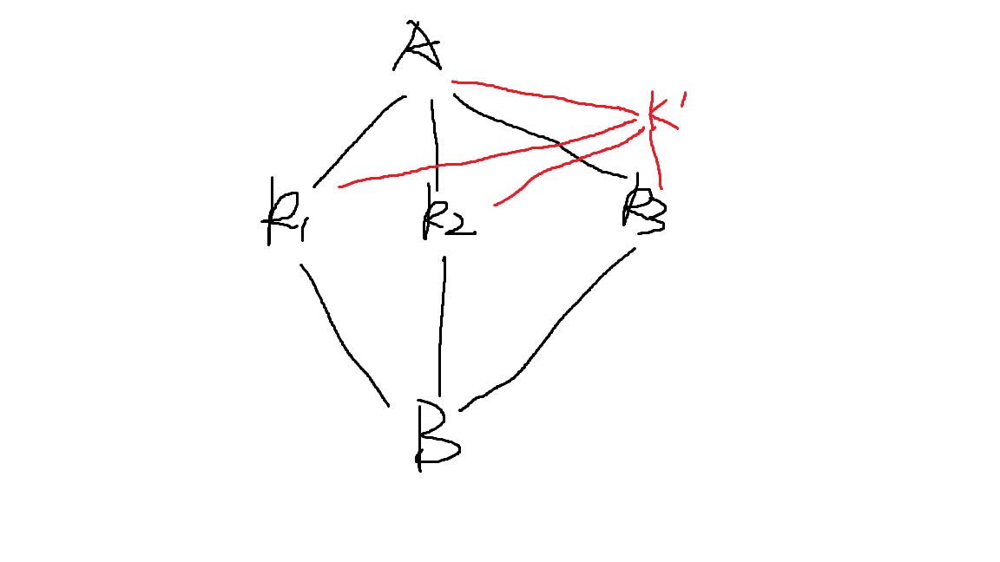

## 网络流建模技巧

实在不会建图就上下界吧（

#### 拆点限流

将一个点拆成两份，在它们之间连一条流量为 $w$ 的边，就加上了**经过这个点的流量不超过 $w$** 的限制

同时拆点配合上下界，也可表示各种其他含义（如这个点必须流过）

#### 转化为最小割

一种比较经典的搞法：给一张图，可以花费 $c_i$ 在 $i$ 点上设置障碍，问使得 $s,t$ 不连通的最小花费

第一眼像是什么费用流，但实际的建模方法：

将每个点拆成两份，$a$ 和 $a'$，由 $a$ 向 $a'$ 连一条容量为 $c_i$ 的有向边，然后这个点的出边由 $a'$ 连出，入边连入 $a$ 点，容量都是INF，这样对原图求一个最小割即可。

[题目2](https://www.luogu.com.cn/problem/P1361)

我们可以先假设获得了所有收益，然后割掉其中一些使之合理

对于每个作物，由A向其连 $a_i$ 的边，其向B连 $b_i$ 的边，此时求最小割即为要从每组a,b中删去一个使图不连通；

假设现在加上了同时选 $k_1,k_2,k_3$ 到A端可以获得额外收益，那么可以理解为：不同时选这三个就必须割掉这个额外收益。那么这么连：

只要Bk1, Bk2, Bk3 有一条没割，Ak'就必须割掉

#### 费用-INF保证流经

[题目](https://www.luogu.com.cn/problem/P4553)

这题放弃思考的话上下界费用流很容易想到

但有个好做法：利用费用流性质，把两点间的费用改为-INF，这样在跑费用流时，保证这条边一定会跑满流，省去了为这条边加下界的麻烦

最后答案再加上若干个INF就可以了

任何要加下界 = 上界限制的边，都可以考虑一下这种搞法

#### 有向图路径覆盖问题

##### 最小路径（可重复）覆盖边

https://www.luogu.com.cn/problem/P4043

DAG上，要求每条**边**都要走一次，可以重复地全部走完，走边需要花费一定时间，可以立即返回起点重新走

利用上下界网络流，限制每条边的流量下限为1，费用即为花费时间

跑一个上下界最小费用可行流

##### 最小路径（可重复）覆盖点

没有题目，自己脑子里云出来的

拆点，然后对点间的边加流量下限就可以了

##### 最小路径（不可重复）覆盖点

好像可以拆点，变成二分图之后减去最大匹配数？

但我感觉上下界网络流是个非常暴力而友好的东西（

在上一题的基础上，给边的流量上限设为1就好了
