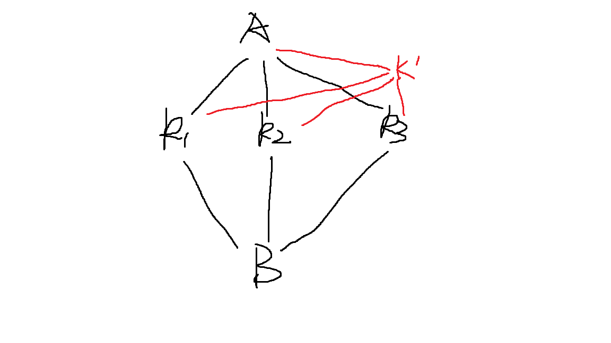

## 网络流建模技巧

实在不会建图就上下界吧（

#### 拆点限流

将一个点拆成两份，在它们之间连一条流量为 $w$ 的边，就加上了**经过这个点的流量不超过 $w$** 的限制

同时拆点配合上下界，也可表示各种其他含义（如这个点必须流过）

#### 染色

常见于方格问题，在网格之间连边时因为边的方向性，常常会遇到重复的问题，此时即可对方格根据奇偶性进行染色处理，由黑格入，白格出，不影响答案的情况下避免歧义。

例题https://www.luogu.com.cn/problem/P2774

#### 转化为最小割

一种比较经典的搞法：给一张图，可以花费 $c_i$ 在 $i$ 点上设置障碍，问使得 $s,t$ 不连通的最小花费

第一眼像是什么费用流，但实际的建模方法：

将每个点拆成两份，$a$ 和 $a'$，由 $a$ 向 $a'$ 连一条容量为 $c_i$ 的有向边，然后这个点的出边由 $a'$ 连出，入边连入 $a$ 点，容量都是INF，这样对原图求一个最小割即可。

[题目2](https://www.luogu.com.cn/problem/P1361)

我们可以先假设获得了所有收益，然后割掉其中一些使之合理

对于每个作物，由A向其连 $a_i$ 的边，其向B连 $b_i$ 的边，此时求最小割即为要从每组a,b中删去一个使图不连通；

假设现在加上了同时选 $k_1,k_2,k_3$ 到A端可以获得额外收益，那么可以理解为：不同时选这三个就必须割掉这个额外收益。那么这么连：

只要Bk1, Bk2, Bk3 有一条没割，Ak'就必须割掉

[ABC 259G](https://atcoder.jp/contests/abc259/tasks/abc259_g)

给出一张 $n$ 行 $m$ 列二维矩阵 $a_{i,j}$，可以选取若干行若干列，总得分为覆盖到的元素之和，若行列交点处为负数，则贡献为负无穷，求最大得分。

建图方法：每行和每列抽象成一个节点，由源点向每行连一条容量为 $max(0, 行和)$ 的边，每列向汇点连一条容量为 $max(0, 列和)$ 的边。

行 $i$ 和列 $j$ 之间连一条容量为 $a_{i,j}$ 的边，若 $a_{i,j}$ 为负，则容量为无穷大。

思路：首先取答案为行和+列和，然后对于任一对行列，都需要减去交点处的值或不选行/不选列，这就是一个最小割问题了，无穷大即意味着必须在行列中选择一个删去。

#### 费用-INF保证流经

[题目](https://www.luogu.com.cn/problem/P4553)

这题放弃思考的话上下界费用流很容易想到

但有个好做法：利用费用流性质，把两点间的费用改为-INF，这样在跑费用流时，保证这条边一定会跑满流，省去了为这条边加下界的麻烦

最后答案再加上若干个INF就可以了

任何要加下界 = 上界限制的边，都可以考虑一下这种搞法

#### 最大费用

费用流的费用是很自由的，求最大费用流可以简单低将费用都取反，结果再取反。

实际应用中可以用最大费用来表示“贡献”

例：https://www.luogu.com.cn/problem/P2770

#### 有向图路径覆盖问题

##### 最少不重复路径覆盖点

即常说的最小路径覆盖

将每个点拆为两份变成一个二分图，每条边 $i,j$ 都变为由 $x_i$ 连向 $y_j$ 容量为1的边，考虑最大合并次数（即最大匹配数），每次合并使得路径总数减一。

##### 最少可重复路径覆盖点

即常说的最小链覆盖，可以先求传递闭包，再转化为最小路径覆盖。

##### 定起点，最小路径（可重复）覆盖边

https://www.luogu.com.cn/problem/P4043

DAG上，要求每条**边**都要走一次，可以重复地全部走完，走边需要花费一定时间，可以立即返回起点重新走

利用上下界网络流，限制每条边的流量下限为1，费用即为花费时间

跑一个上下界最小费用可行流

##### 定起点，最小路径（可重复）覆盖点

没有题目，自己脑子里云出来的

拆点，然后对点间的边加流量下限就可以了

## 其他

##### 残量网络

可以利用残量网络推断路径或方案。

##### 增边

例题：

https://ac.nowcoder.com/acm/contest/36913/1002

https://ac.nowcoder.com/acm/contest/36913/1012

在图上增加新的边之后，可以在原先的残量网络基础上再跑最大流，不需要重新建图（注意这样跑到的流量也为增量）。

## 一些例题

[吃豆豆](https://www.luogu.com.cn/problem/P4066)

首先这题中，双方路径不交叉这个条件没有任何卵用（

因为交叉的路径一定可以改成不交叉的路径，双方等价，实际上就是找两条链，经过最多的节点

这两条链我们视为可交叉的，但是经过同一个点只能计算一次收益，那么一个点和它的拆点之间应该连两条边，一条费用为-1为计算收益，另一条费用为0表示跳过

因为要压缩边数，有些实际上能一步到达的点，在途中路径被我们压掉了，因此这个费用0的跳过边是必须的，这样才能确保到达原本能到达的所有点。

除此之外，两点之间的连边也权值也应该设成2，因为可能两条链都走了这么一条边。

总而言之，把它当成两条链的覆盖来做就好了，不要被原来的题意影响（

[魔术球](https://ac.nowcoder.com/acm/contest/36913/1002)

不断加新的节点进来，每次加边都在残量网络上再跑一次最大流更新结果（最大流本身就是个最小路径覆盖问题），由此可以计算出最多能放的球个数。

计算时，处理完第 $x+1$ 个点后我们才能知道最多能放的个数是 $x$，这时残量网络中留下的是 $n+1$ 个柱子的方案，所以我考虑整个删掉重新跑一遍 $x$ 个点的图，却发现没必要：因为添加的第 $x+1$ 个点必然不产生新的流量，不会影响前 $x$ 个点的残量网络。

代码见提交记录

