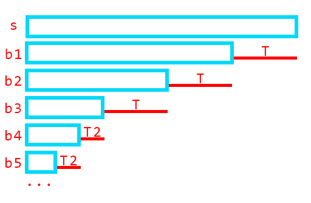

> 参考资料：
> https://www.cnblogs.com/chasedeath/p/13396877.html
>
> https://www.cnblogs.com/y-dove/p/14514097.html

字符串 $s$ 的**border**：若 $s$ 的一个子串既是它的前缀又是它的后缀，则这个子串是它的border（一般不包含本身）

字符串 $s$ 的**period**：循环节。用前 $T$ 个字符向后不断复制，能得到 $s$，最后一次可以只复制一部分

下文中，$n$ 表示整个字符串长度

---

2022/3/2 更新：发现以前的思路比较歪，对于周期 $T$，应该这样理解：对任意一个位置 $i$，都有 $s_i =s_{i+T}$ （当然，不能超过右边界），这样想的话很多东西都很好理解了

------

**引理1：如果 $s$ 有一个border $k$ ，则 $s$ 有周期 $|s|-|k|$**

同时，中间重叠部分是一个border，绿色部分构成了一组等差数列border，公差为周期：


前 $T$ 个字符是周期的话，后 $T$ 个显然也是周期：


这个引理建立了border与周期之间的关系

------

**引理2（弱周期引理）：如果 $p,q$ 都为周期，且 $p+q\le n$ ，则 $gcd(p, q)$ 也为周期**

假设这两个周期 $p\gt q$，那么任意一个点 $i$ 都有：

- $s_i=s_{i+p}=s_{i+p-q}$ 或者
- $s_i = s_{i-q} = s_{i-q+p}$

那么 $p-q$ 就也是周期啦

辗转相减下去，就变成 $gcd(p,q)$ 为周期了

存在例外：如果存在 $i-q$ 和 $i+p$ 都超出边界的点，即 $p+q>n$，则上述说法不成立

这个引理可以拓展到 $p+q\le n+gcd(p,q)$，同样成立，但我不会证（

------

**引理3：字符串 $s$ 的border中含有大段等差数列**

假设 $s$ 有最大border $u$，对应的最小周期为 $T$

那么对于任一border $v$，其对应的周期为 $t=n-|v|$， 若有$t+T\le n$ ，则 $t$ 为 $T$ 的倍数，否则 $gcd(t, T)$ 将成为更小的周期

也就是说，所有大于 $T$ 的border构成了一个公差为 $T$ 的等差数列

对 $T$ 取模，字符串长度至少减半，那么整个字符串存在至多 $log(n)$ 组等差数列

这个结论，直观来看长这样：



------

**应用：为什么要考虑border中的等差数列？**


如图所示，$s$ 的所有成等差数列的border，其下一位一定相同

在KMP匹配中，我们可以利用这个性质快速跳过一串border

具体而言，在一次跳border时，如果发现border长度不小于原串的一半，则接下来的border构成等差数列，直到一半以下（引理3）

可以直接跳到 $(x-(x/2/d)*d)$ 处，即比一半大的第一个位置（整除）

（网上博客直接跳到了 $x\%d+d$ 处，经过几道题检验也是对的，但不是很能理解）

一次至少跳一半，保证 $log$ 次以内可以跳完


例题：[P5829 【模板】失配树](https://www.luogu.com.cn/problem/P5829)

标解是建树后LCA，我们这个稳定跳log次border的“暴力匹配”可以更优雅地过这个题

```c++
int n, m;
string s;
int nt[maxn];

void get_next(){
    nt[1] = 0;
    for(int i=2;i<=n;i++){
        int p = nt[i-1];
        while(p && s[p+1] != s[i]) p = nt[p];
        if(s[p+1] != s[i]) nt[i] = 0;
        else nt[i] = p + 1;
    }
}

void solve() {
    cin >> s; n = s.size();
    s = '0' + s;
    get_next();
    cin >> m;
    while(m--){
        int x, y; cin >> x >> y;
        x = nt[x], y = nt[y];
        while(x != y){
            if(x < y) swap(x, y);
            if(nt[x] > x/2){
                int d = x - nt[x];
                if(y % d == x % d) x = y;
                else x = x % d + d;//大优化
            }else x = nt[x];
        }
        cout << x << '\n';
    }
}
```


例题：[2021ICPC沈阳站M](https://ac.nowcoder.com/acm/contest/24346/M)

当前位置的答案即为上一位置的答案的某个border加上新字符；找到最小的 加上新字符后大于原答案的border即可。（有一定难度，具体见题解）

```c++
int n, m;
string s;
int nt[maxn];

int head = 0;
void expend_nt(int frm, char c){
    if(frm == 0){
        nt[frm+1] = 0;
        return;
    }
    int p = nt[frm];
    while(p && s[head+p+1] != c) p = nt[p];
    if(s[head+p+1] != c) nt[frm+1] = 0;
    else nt[frm+1] = p + 1;
}

void solve() {
    cin >> s; n = s.size();
    s = '0' + s;
    nt[1] = 0;
    cout << "1 1\n";
    int lst = 1;
    for(int i=2;i<=n;i++){
        int x = lst, len = lst + 1;
        while(x > 0){
            if(s[i] > s[i-lst+x]) len = x + 1;
            if(nt[x] > x/2){
                int d = x - nt[x];
                x = x % d + d;
            }else x = nt[x];
        }
        if(s[i] > s[i-lst]) len = 1;
        head = i - len;
        expend_nt(len-1, s[i]);
        lst = len;
        cout << i-len+1 << ' ' << i << '\n';
    }
}
```

