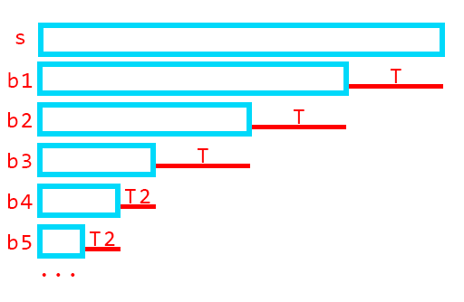

如果 $s$ 是一个回文串，且 $t$ 是 $s$ 的后缀回文子串，我们可以从中获取到很多信息：

首先，$s$ 的border和 $s$ 的后缀回文子串等价（即如果它是border，那一定是后缀回文子串，反之亦然）

- 因为 $s$ 是回文串，把border平移和翻转得到了同一个东西，自然border都是回文的，反之也一样

那么可以直接套用border原理中的结论：

- $s$ 的后缀回文子串能组成至多 $log(|S|)$ 组等差数列
- 组成方式和border原理中一样，图再放一下：

