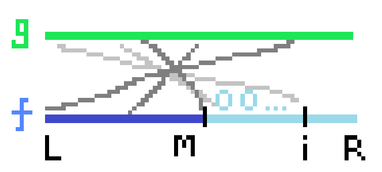

处理类似于：$f_i=\sum_{j=1}^i f_jg_{i-j}$ 的问题

呈卷积形式，但每一项都为前面的 $f$ 和 $g$ 的卷积，故不能直接fft/ntt快速求得。

考虑 $cdq$ 分治，分治的过程也是从左往右依次处理的，可以在计算出 $f_{l,mid}$ 后加上它对 $f_{mid+1,r}$ 的影响。

这个影响可以通过卷积快速计算得出。



如图所示，当前 $f_{l..m}$ 已经计算完毕，此时直接计算 $f$ 与 $g$ 在这部分的卷积（$f$ 右半部分视为0），对于任意的右边位置 $i$，左半边对其贡献即为卷积后 $(f\times g)_i$ 处的值。

换个角度也很好理解，本来 $f_i$ 是其前面部分与 $g$ 的卷积，现在将前 $i$ 个值分为若干段，每段独立计算时右边部分都为0，卷积时自然忽略，很对。

```c++
int g[maxn], f[maxn];
void cdq(int l, int r) {
    if(l == r) return;
    int mid = (l + r) / 2;
    cdq(l, mid);
    Poly::multipy(g, r - l, f + l, mid - l);
    for(int i = mid + 1;i <= r;i++) {
        (f[i] += Poly::ta[i - l]) %= mode;
    }
    cdq(mid + 1, r);
}

void solve() {
    int n;
    cin >> n;
    for(int i = 1;i < n;i++) cin >> g[i];
    g[0] = 0, f[0] = 1;
    cdq(0, n - 1);
    for(int i = 1;i <= n;i++) cout << f[i - 1] << " \n"[i == n];
}
```

