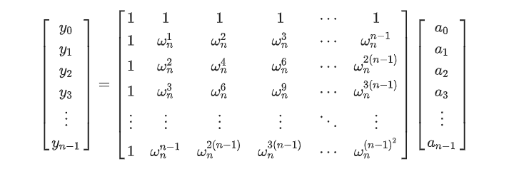

### 卷积和多项式

多项式相乘：$(a_0+a_1x+a_2x^2..)\times (b_0+b_1x+b_2x^2..)$

得到的结果当中，$x^k$ 项的系数为 $a_0\times b_k+a_1\times b_{k-1}...$

这便是一个卷积形式。

多项式相乘即求两个系数数组卷积后，前 $n+m$ 项的值。

**卷积具有交换律，结合律**（因为多项式乘法有）


### 快速傅里叶变换（fft）

用途：两个多项式乘积的快速计算

首先需要知道多项式有两种表示方式，一种是用 $n+1$ 个系数表示，另一种是用 $n+1$ 个点值来表示。

任取 $n+1$ 个不重复的点，都能唯一确定一个 $n$ 阶多项式

证明：~~举不出反例，易得~~

那么我们可以取一组相同的 $x_{1...n}$，分别代入两个多项式求得其点值表示，对应点值相乘不就得到新多项式了吗（

FFT分两个步骤，DFT和IDFT，它们可以在 $nlogn$ 的时间里完成多项式系数表示法和点值表示法之间的切换


#### DFT：

如果随便取 $n$ 个坐标代入计算点值，那么总体是 $O(n^2)$ 的

我们希望计算尽可能简单，如果 $x$ 取1和-1，那么它们的次幂会很好算，但这还不够。为了找更多类似1和-1的数，我们不惜扩张数系（

##### 单位复根

在复数域上，我们可以找到大量模长为1的数，但性质可以更好一些。

首先介绍一下复数乘法的几何含义：模长相乘，辐角相加

也就是说任意两个复数相乘，把它们都在复平面上用向量表示，那么它们的乘积即这两个向量的角度叠加，模长乘的结果。

我们最终选取这组 $x$ 点值是：将复平面上的单位圆等分成 $n$ 份，每份取一点

图源oiwiki：


其中第 $x$ 条分界线上的点为 $e^{2\pi jx/n}$，表示为 $w_n^x$，我们就要取 $w_n^0...w_n^{n-1}$

显然 $w$ 有性质：

- $w_n^{ik}=(w_n^i)^k$
- $w_n^k=w_{2n}^{2k}$
- $-w_{2n}^k=w_{2n}^{k+n}$

**注意**：我们取的这组 $x$ 点必须满足上述三条性质，才能用下述方式加速，在ntt等变换中用其他东西替代这组 $w$ 时需注意。


接下来就是DFT的过程了：

设现有系数表示的多项式为 $f(x)=a_0x+a_1x+...a_{n-1}x^{n-1}$

我们可以把它分奇偶拆开：

$f(x)=(a_0+a_2x^2+...)+(a_1x+a_3x^3+...)$

右边再提出一个 $x$

$=(a_0+a_2x^2+...)+x(a_1+a_3x^2+...)$

将两边的系数看成新多项式 $G(x)$ 和 $H(x)$ 的系数，那么：

$f(x)=G(x^2)+x\times H(x^2)$

这时候我们尝试将 $w_n^k$ 代入 $x$：

$G(x^2)=G(w_n^{2k})=G(w_{n/2}^k)$ （只需要 $n$ 是偶数即可）

因为 $G$ 和 $H$ 的数据规模本就是 $n/2$，相当于已经成为完全独立的子问题了，我们可以递归求解

关键在于：我们可以把所有的 $w_n^k$ 丢进去一起算，这样就能 $O(nlogn)$ 时间计算所有 $w$ 代入后的点值了。

>  常见算法的处理逻辑：
> 首先得到一组系数 $a_{0..n-1}$，设计函数 $dft(a, n)$，传入系数组 $a$，计算得到函数在 $w_n^{0..n-1}$ 处的y值返回。
>
> 处理 $f$ 时，两个子问题 $g$ 和 $h$ 分别返回了 $x=w_{n/2}^{0..n/2}$ 的一组结果，此时再枚举代入 $w_n^{i\in[0..n)}$ 的结果，$f(w_n^i)=g(w_{n/2}^i)+w_n^ih(w_{n/2}^i)$ ，注意性质 $w_n^i=w_n^{i-n/2}$
>
> 因为系数和结果的下标都是 $0..n-1$，所以可以直接在一个数组中搞定，传入时为系数，处理完返回时改为点值。

为了保证每次分治之后 $n$ 都是偶数，需要在开始前先将多项式补为有 $n$ 项（$0...x^{n-1}）$的多项式。

##### 优化加速

[位置逆序变换 ](https://oi-wiki.org/math/poly/fft/#_5) 递归变迭代

三次变两次：将 $g(x)$ 放到 $f(x)$ 的虚部上去，求出 $f(x)^2$ 的虚部的一半即为结果，原理即：

$(a+bi)^2=a^2+b^2+2abi$


#### IDFT：

好消息：点值转系数不需要写多余的代码

我们从矩阵的角度考虑系数转点值 $y$ 的过程，其实是这样的一个变换：（图源oiwiki）



因为我们始终采用同一套 $x$，在反变换时，是不是让 $y$ 乘上这个矩阵的逆矩阵就可以了（

而这个矩阵的逆矩阵也很好看：就是原矩阵每一项都取倒数，再除 $n$ 

那么矩阵集体除 $n$ 我们先提出来，其实就是每个 $w_n^k$ 都变成 $w_n^{-k}$

所以直接对 $y$ 再进行一次DFT，其中把 $w_n^k$ 变成 $w_n^{-k}$，最后再集体除 $n$ 即可！ 

```C++
struct comp{
    double x, y;
    comp() = default;
    comp(const double &a, const double &b): x(a), y(b){};
    comp operator *(const comp &t) const{
        return comp(x * t.x - y * t.y, x * t.y + t.x * y);
    }
    comp operator +(const comp &t) const{
        return comp(x + t.x, y + t.y);
    }
    comp operator -(const comp &t) const{
        return comp(x - t.x, y - t.y);
    }
};

namespace Poly{
    int rev[maxn << 2];
    void calcurev(int n) { //预处理rev
        rev[0] = 0;
        for(int i = 1; i <= n; i++) {
            rev[i] = rev[i >> 1] >> 1;
            if(i & 1) rev[i] |= n / 2;
        }
    }
    void fft(comp *a, int n, int dft = 1){ //传入为a[0..n-1]，将其转为点值后写回a
        for(int i=0;i<n;i++){
            if(i < rev[i]) swap(a[i], a[rev[i]]);
        }
        for(int len = 2; len <= n; len *= 2){ //枚举合并的区间长度
            comp wx(cos(2 * M_PI / len), sin(2 * M_PI / len) * dft);
            for(int l = 0; l + len - 1 < n; l += len){ //枚举合并区间的左端点
                int mid = l + len / 2;
                comp w(1, 0);
                for(int i = l; i < mid; i++, w = w * wx){ //合并
                    comp x = a[i], y = w * a[i + len / 2];
                    a[i] = x + y;
                    a[i + len / 2] = x - y;
                }
            }
        }
        //idft最后的集体除n
        if(dft == -1) for(int i = 0; i < n; i++) a[i].x /= n, a[i].y /= n;
    }
    comp f[maxn << 2], g[maxn << 2];
    int res[maxn << 2];
    void multipy(int *a, int n, int *b, int m){ //计算卷积 a[0..n] x b[0..m]，答案写入res;
        int lim = 1;
        while(lim <= n+m) lim *= 2;
        calcurev(lim);
        for(int i=0;i<lim;i++) f[i] = g[i] = {0, 0}; //清空
        for(int i=0;i<=n;i++) f[i].x = a[i];
        for(int i=0;i<=m;i++) g[i].x = b[i];
        fft(f, lim); fft(g, lim);
        for(int i=0;i<lim;i++) f[i] = f[i] * g[i];
        fft(f, lim, -1);
        for(int i=0;i<=n+m;i++) res[i] = f[i].x + 0.5; //反变换后结果在实部，可以+0.5避免浮点误差
    }
};

int a[maxn], b[maxn];
void solve() {
    int n, m;
    cin >> n >> m;
    for(int i=0;i<=n;i++) cin >> a[i];
    for(int i=0;i<=m;i++) cin >> b[i];
    Poly::multipy(a, n, b, m);
    for(int i=0;i<=n+m;i++) cout << Poly::res[i] << " \n"[i == n + m];
}
```

除标准形式外，三步变两步是一个较大的优化：

```cpp
for(int i=0;i<=n;i++) f[i].x = a[i]; //两组系数分别放实部和虚部
for(int i=0;i<=m;i++) f[i].y = b[i];
fft(f, lim);
for(int i=0;i<lim;i++) f[i] = f[i] * f[i]; //平方后，虚部即2ab
fft(f, lim, -1);
for(int i=0;i<=n+m;i++) res[i] = f[i].y / 2 + 0.5;
```

但这种优化多了一个平方，会使得精度大大降低。


### 快速数论变换（ntt）

fft要用到复数域操作以及三角函数，有精度和效率问题，在问题要求取模时也不能用fft

快速数论变换（ntt）采用一组在模 $p$ 意义下的根来代替单位复根，它们同样具备单位复根的若干性质，所以可以直接替代fft中的单位复根。

#### 原根：

任意数 $p$ 有原根 $g$，即 $g^i\equiv 1\mod p$ 的最小正整数解为 $\phi(p)$

当 $p$ 为质数时，即 $g^{p-1}\equiv1$， $g^i\mod p$ 对于 $i\in [0, p-1)$ 各不相同。

求法性质之类的在此不赘述，常见的有原根质数：998244353 原根3

注意到这也和圆周一样循环，且 $i$ 在指数上，那么若将 $[0,p-1]$ 分为 $n$ 份，每一份作为一个根，这组根就满足我们需要的那些性质：

设第 $i$ 个根为 $g_n^i=g^{\frac{p-1}{n}\times i}$，其中要求 $p-1$ 能被 $n$ 整除，且 $n$ 是2的次幂，则有性质：

- $(g_n^i)^k=g_n^{ik}$

- $g_{2n}^{2k}=g_n^k$

- $g_{2n}^k=-g_{2n}^{k+n}$

关于最后一个，等价于 $g_n^{n/2} \equiv -1$，**不太会证这一条，先跳过**

总之满足了这些条件就可以很自然地替换到fft的板子里去了。

关于上述 $p-1$ 必须被 $n$ 整除的条件，常见的 $998244353=119\times 2^{23}$，只要取的二次幂小于 $2^{23}$ 即可。通常 $O(nlogn)$ 的ntt本身也处理不到这么大的范围。

```c++
namespace Poly {
    const int P = 998244353, G = 3, Gi = qpow(G, P - 2);
    // 质数，原根，原根逆元
    int rev[maxn << 2];
    void init(int n) { //预处理rev, n为2^
        rev[0] = 0;
        for(int i = 1; i <= n; i++) {
            rev[i] = rev[i >> 1] >> 1;
            if(i & 1) rev[i] |= n / 2;
        }
    }
    int getlim(int n) {
        int lim = 1;
        while(lim <= n) lim *= 2;
        return lim;
    }
    void ntt(int* a, int n, bool inv = false) {
        for(int i = 0; i < n; i++) {
            if(i < rev[i]) swap(a[i], a[rev[i]]);
        }
        for(int len = 2; len <= n; len *= 2) { //枚举合并的区间长度
            int gx = qpow(inv ? Gi : G, (P - 1) / len);
            for(int l = 0; l + len - 1 < n; l += len) { //枚举合并区间的左端点
                int mid = l + len / 2, g = 1;
                for(int i = l; i < mid; i++, g = (ll)g * gx % P) { //合并
                    int x = a[i], y = (ll)g * a[i + len / 2] % P;
                    a[i] = (x + y) % P;
                    a[i + len / 2] = (x - y + P) % P;
                }
            }
        }
        if(inv) {
            int v = qpow(n, P - 2);
            for(int i = 0; i < n; i++) a[i] = (ll)a[i] * v % P;
        }
    }
    // int ta[maxn << 2], tb[maxn << 2]; //快速相乘，计算 a[0..n] * b[0..m]，结果存入ta
    // void multipy(int* a, int n, int* b, int m) { //此处不改变a, b数组
    //     int lim = getlim(n + m);
    //     init(lim);
    //     for(int i = 0; i < lim; i++) { //copy
    //         ta[i] = i <= n ? a[i] : 0;
    //         tb[i] = i <= m ? b[i] : 0;
    //     }
    //     ntt(ta, lim), ntt(tb, lim);
    //     for(int i = 0; i < lim; i++) ta[i] = (ll)ta[i] * tb[i] % P;
    //     ntt(ta, lim, true); //结果存入ta
    // }
};
```

手动ntt需注意：传入ntt函数的范围均为lim，并且lim范围内，原n范围外的地方也需要置为0。

相乘时务必将 $[0, lim)$ 中的每个位置都相乘，再逆变换才能得到正确结果。
